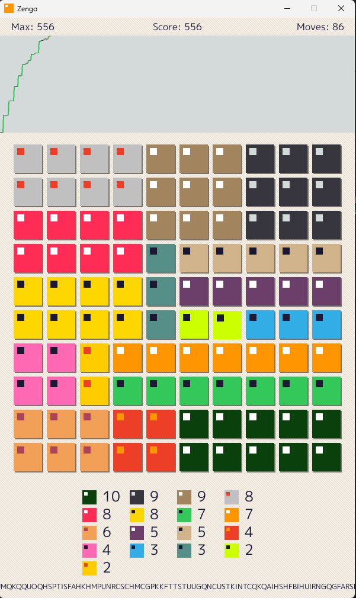
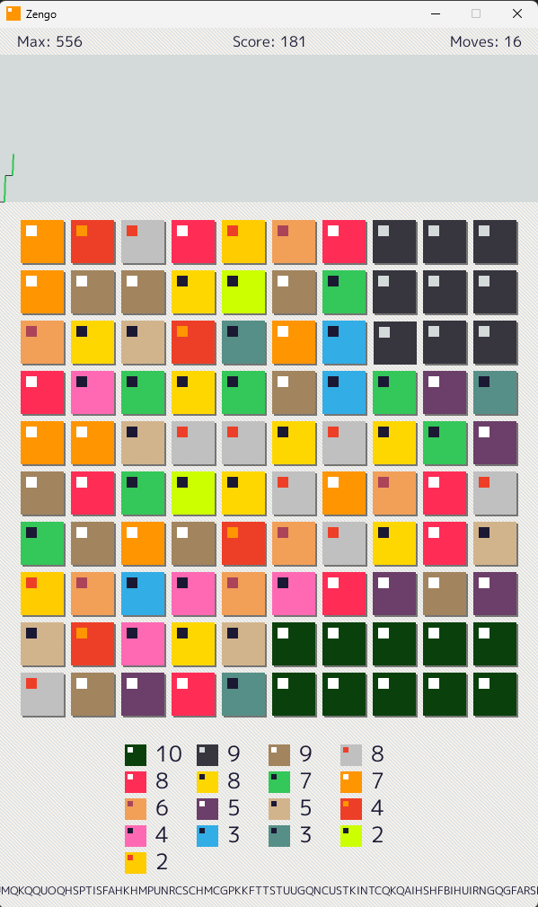

# Zengo
<p align="middle">


</p>
<br clear="all">

`Zengo` is a minimalist and relaxing puzzle game about arranging colored tiles into solid groups. Find the optimal arrangement to achieve the maximum score and fill the progress bar. Each game is procedurally generated, offering a new, unique challenge.

## How to Play

*   **Goal**: Bring all tiles of the same color together into a single, contiguous group.
*   **Controls**: Click on a tile to select it. Then click on an target tile to swap them. Each swap costs one move.
*   **Strategy**: Plan your moves ahead!  The display below the game board shows you how many tiles of each color are on the board. At the beginning the arranging goes easy but later you may end up in a situation forcing you to rearrange whole groups, to reach the full score. Your strategies for allocating groups on the board will get better with each game you play.

## Scoring

Your goal is to fill the progress bar to 100%. You achieve this by forming the optimal shape for each color.

*   A group is only scored if **all** tiles of that color on the board form a single, contiguous group.
*   **Lines**: A group that forms a horizontal or vertical line receives points equal to its length (e.g., 5 tiles in a row = 5 points).
*   **Rectangles**: A group that forms a solid rectangle (e.g., 2x3) receives a high score according to the formula `Number of tiles * Width * Height` (e.g., 6 tiles in a 2x3 rectangle = 6 * 2 * 3 = 36 points).
*   Other shapes (e.g., L-shapes or rectangles with holes) score **zero** points.

The progress bar shows you how close you are to the theoretically maximum possible score for the given starting layout.

## Features

*   **Procedural Levels**: Every game is unique.
*   **Strategic Depth**: The tile distribution display allows for forward planning.
*   **Mobile-Friendly Layout**: The aspect ratio is optimized for a future port to smartphones.
*   **Minimalist Design**: A clean and distraction-free gaming experience.

## How to Build

You need the Go programming language to compile the game.

### Windows

In the project's root directory, run the following command to create a `Zengo.exe` (without a console window):

```bash
go build -ldflags="-H windowsgui" -o Zengo.exe .
```

## Technology

*   **Engine**: Ebitengine https://ebitengine.org/ | https://github.com/hajimehoshi/ebiten
*   **Language**: Go https://go.dev/ | https://github.com/golang
*   **AI**: Gemini Code Assist | https://codeassist.google/